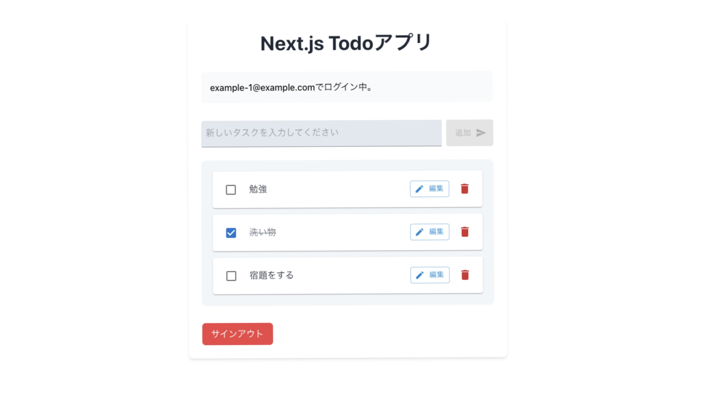

# ポートフォリオ ― Next.js TODO アプリ

ご覧いただきありがとうございます。

このリポジトリは、**モダンなフロントエンド技術（Next.js）** と **Firebase** を活用し、  
Web 開発の基礎と実践力を体系的に身につけることを目的として作成しました。  
その成果をポートフォリオとしてまとめています。

---

## 🚩 デモ・スクリーンショット

デプロイ先: [https://portfolio-nextjs-app-ebon.vercel.app/](https://portfolio-nextjs-app-ebon.vercel.app/)  
 **テスト用アカウント**

- メールアドレス: example123@example.com
- パスワード: example123

スクリーンショット:


---

## 🛠️ 主な技術スタック

| カテゴリ             | 技術                        |
| -------------------- | --------------------------- |
| **フロントエンド**   | Next.js(React), TypeScript  |
| **DB・バックエンド** | Firebase (Firestore)        |
| **UI**               | TailwindCSS, MUI            |
| **フック**           | useSWR, useAuth             |
| **フォーム管理**     | Zod, React Hook Form        |
| **テスト**           | Jest, React Testing Library |
| **CI/CD**            | GitHub Actions              |

---

## 🎯 こだわりポイント

- **モダンなフロントエンド開発**: Next.js(React)+TypeScript を用いたモダンな構成。
- **型安全設計**: TypeScript による型定義。
- **各種ライブラリ、フックの活用**: 実用的な技術の使用による開発の効率化、ユーザー体験の向上。
- **認証連携**: Firebase Auth でユーザーごとのデータ分離を実現。
- **UI/UX**: MUI と TailwindCSS を併用し、シンプルで直感的な UI を実現。ローディング状態の視覚化と notistack によるトースト通知を実装し、ユーザー体験を向上。
- **テスト駆動**: テストを意識した関心事の分離と、クリーンアーキテクチャを意識したレイヤー設計。
- **デプロイ自動化**: GitHub Actions と Vercel による CI/CD パイプライン。

---

## 🧗‍♂️ 苦労した点/解決方法

- **問題点:** 1 つのコンポーネント、関数に複数の責務を詰め込むと、変更時に副作用が広範囲へ波及し保守コストが増加する。  
  → **解決策:** 共通処理をカスタムフック／ユーティリティへ切り出し、「単一責任の原則」を徹底。
- **問題点:** null を許容したまま型設計を行うと、潜在的なエラーの原因になる。  
  → **解決策:** 下位レイヤーで null／エラーを処理し、上位コンポーネントには常に非 null の型保証データを渡す。
- **問題点:** props が過多だと親子コンポーネントの結合度が高まり、再利用性・テスト容易性が低下する。  
  → **解決策:** コンポーネント粒度と階層を再設計し、必要最小限の props に最適化。
- **問題点:** Firebase との連携処理をコンポーネント内に直接記述すると、テストが複雑化しモックが困難になる。  
  → **解決策:** Firebase 操作をサービス層に分離し、明確なインターフェースを定義。テスト時は簡単にモック可能な構造に。
- **問題点:** フォーム状態管理とバリデーションロジックが各所に散らばると、一貫性の維持が困難になる。  
  → **解決策:** React Hook Form と Zod を導入し、フォーム処理を一元化。型安全なバリデーションスキーマで実行時エラーを防止。

---

## 🏃‍♂️ ローカルでの動作方法

```bash
git clone https://github.com/SHG9-hub/portfolio-nextjs-app.git
cd portfolio-nextjs-app
yarn install
yarn dev
```

- ブラウザで [http://localhost:3000](http://localhost:3000) へアクセス

---

## 🔗 他のリンク・関連実績

最後までご覧いただきありがとうございます。
よければ下記リンクの方もご覧ください。

- [Rails+Docker+AWS 勤怠管理アプリ（GitHub リポジトリ）](https://github.com/SHG9-hub/portfolio-rails-docker-app)
- [Rails+Docker+AWS 勤怠管理アプリ（デプロイ版）](https://odevhub.com)
- [学習まとめ記事（Zenn）](https://zenn.dev/shz_9/articles/b7cf27b802540a)

---
